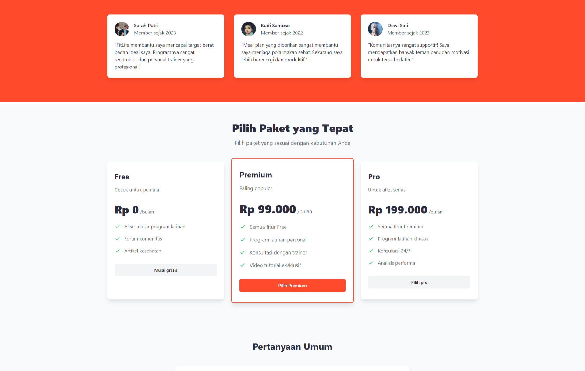
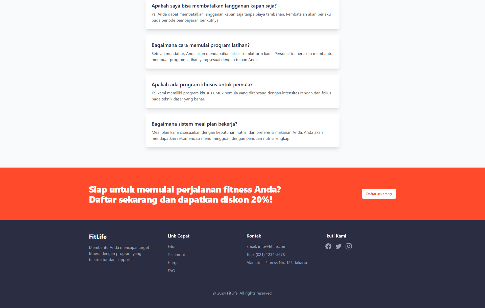
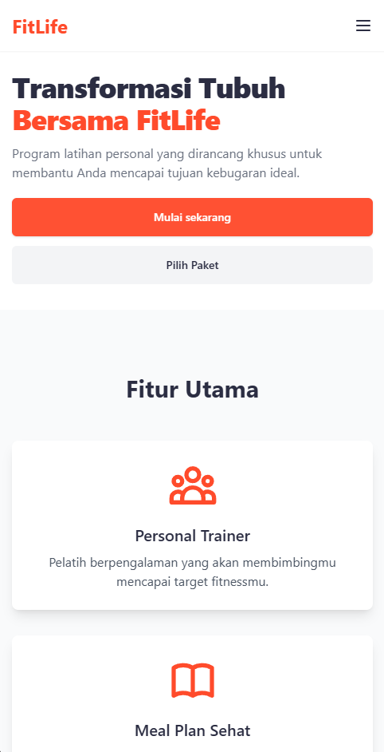
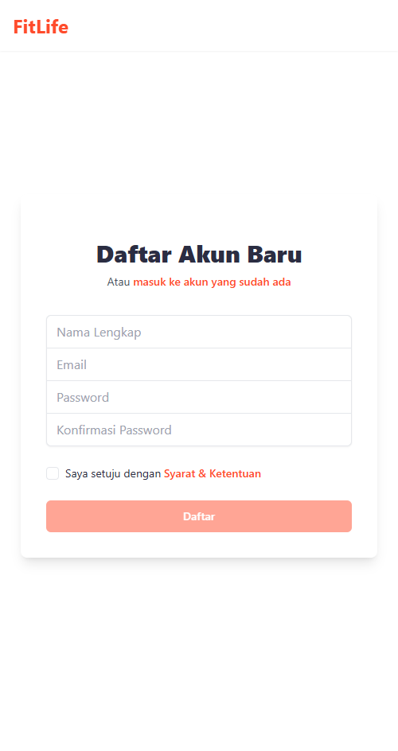

# 💪 FitLife – Fitness Landing Page (Svelte Frontend Only)

**FitLife** adalah aplikasi landing page frontend statis bertema kebugaran yang dibangun dengan **Svelte 5**, **TailwindCSS**, dan **Svelte SPA Router**. Aplikasi ini dirancang untuk menampilkan fitur, testimoni, harga, dan form login/register secara interaktif dan responsif, cocok untuk demo produk atau aplikasi berbasis layanan kebugaran.

---

## 📌 Fitur Utama

- 🎯 **Landing Page Interaktif** – Komponen Hero, Fitur, Testimoni, Pricing, FAQ, dan Call-to-Action.
- 📱 **Fully Responsive Design** – Desain mobile-first dengan TailwindCSS.
- 🧩 **Routing Satu Halaman (SPA)** – Navigasi antar halaman menggunakan `svelte-spa-router`.
- 💬 **Form Login & Register** – Validasi frontend + demo notifikasi menggunakan `svelte-sonner`.
- ✨ **Animasi Scroll** – Menggunakan AOS untuk efek scroll yang halus.
- 🎨 **Mode Watcher & UI Library** – Styling modern dengan `bits-ui`, `lucide-svelte`, dan `tailwind-variants`.

---

## 🧰 Tech Stack

### 🎨 Frontend

- [Svelte 5](https://svelte.dev/)
- [TailwindCSS](https://tailwindcss.com/)
- [Svelte SPA Router](https://github.com/ItalyPaleAle/svelte-spa-router)
- [AOS (Animate on Scroll)](https://michalsnik.github.io/aos/)
- [Lucide Svelte Icons](https://lucide.dev/)
- [Svelte Sonner](https://sonner.emilkowal.ski/svelte)
- [Bits UI](https://ui.bits.build/)

### ⚙️ Tooling

- Vite
- TypeScript
- PostCSS + Autoprefixer
- Tailwind Merge + Variants
- Mode Watcher

---

## 🥪 Struktur Halaman

| Halaman  | Path        | Deskripsi                       |
| -------- | ----------- | ------------------------------- |
| Home     | `/`         | Landing page utama              |
| Login    | `/login`    | Form login pengguna (demo)      |
| Register | `/register` | Form registrasi pengguna (demo) |

---

## 🚀 Cara Menjalankan

1. **Clone repo ini**

```bash
git clone https://github.com/yourusername/fitlife-landingpage.git
cd fitlife-landingpage
```

2. **Install dependencies**

```bash
npm install
```

3. **Jalankan secara lokal**

```bash
npm run dev
```

4. **Build untuk produksi**

```bash
npm run build
```

5. **Preview hasil build**

```bash
npm run preview
```

---

## 📝 Catatan Demo

- Form Login & Register **tidak terhubung ke backend**, tetapi menunjukkan validasi & notifikasi sukses sebagai demo UI.
- Fitur **"Lupa Password"** hanya menampilkan notifikasi demo.
- Semua checkbox, validasi, dan form alert menggunakan `svelte-sonner` untuk efek real-time.

---

## 📷 Preview


---

## 👨‍💼 Developer

- Website: [https://ahmadfiqrioemry.com](https://ahmadfiqrioemry.com)
- Instagram: [@oemryfiqri](https://instagram.com/oemryfiqri)
- Medium: [@foemry](https://medium.com/@foemry)
- LinkedIn: [linkedin.com/in/ahmadfiqrioemry](https://linkedin.com/in/ahmadfiqrioemry)

---

## 📄 Lisensi

This project is licensed under the MIT License – feel free to use and modify.

---

## 🪩 Folder Highlights

```
src/
├── components/        # Komponen UI seperti Hero, CTA, Footer, dll
├── pages/             # Halaman utama: Home, Login, Register
├── routes.ts          # Routing SPA
├── app.css            # Global styles dengan Tailwind
└── main.ts            # Entry point aplikasi
```

## More Preview





