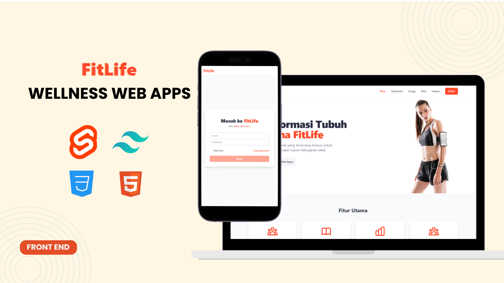

# 💪 FitLife – Fitness Landing Page (Svelte Frontend Only)

**FitLife** is a static fitness-themed frontend landing page built with **Svelte 5**, **TailwindCSS**, and **Svelte SPA Router**. It is designed to showcase features, testimonials, pricing plans, and login/register forms in an interactive and responsive manner—ideal for demoing wellness or SaaS-based products.

---

## 1. Project Overview

FitLife was created to demonstrate a static landing page concept for health and fitness platforms. The project focuses on delivering an aesthetically pleasing, responsive, and single-page layout that highlights service benefits and encourages user engagement through CTAs and authentication UIs.

---

## 2. Project Goals

- Build a mobile-first, fully responsive landing page.
- Showcase a typical SaaS-style homepage with pricing, testimonials, and feature breakdowns.
- Simulate login and registration UI without backend logic.
- Apply TailwindCSS and Svelte transitions to demonstrate smooth interactive experience.

---

## 3. Challenges

- Structuring modular UI components for dynamic sections like testimonials and pricing.
- Managing route transitions while preserving layout consistency.
- Applying utility-first Tailwind design within scoped Svelte components.
- Integrating scroll-based animations without breaking responsiveness.

---

## 4. Approach & Solution

Svelte 5 and `svelte-spa-router` were used to implement SPA navigation with lightweight performance. Components were built with `bits-ui`, styled via TailwindCSS, and enhanced using `tailwind-variants` for reusable variants. The project simulates form behavior using `svelte-sonner` for toast notifications and leverages AOS for elegant scroll effects.

---

## 5. Key Features

- 🌟 **Interactive Landing Page** – Includes Hero, Features, Testimonials, Pricing, FAQ, and CTA sections.
- 📱 **Fully Responsive Design** – Mobile-first approach using TailwindCSS.
- 🧹 **Single Page Application (SPA)** – Routing handled via `svelte-spa-router`.
- 💬 **Login & Register Forms** – Frontend validation and toast demo using `svelte-sonner`.
- ✨ **Scroll Animations** – Powered by AOS for smooth section transitions.
- 🎨 **Modern UI Styling** – Utilizes `bits-ui`, `lucide-svelte`, and `tailwind-variants` for modular component design.

---

## 6. Tech Stack

- [Svelte 5](https://svelte.dev/)
- [TailwindCSS](https://tailwindcss.com/)
- [Svelte SPA Router](https://github.com/ItalyPaleAle/svelte-spa-router)
- [AOS (Animate on Scroll)](https://michalsnik.github.io/aos/)
- [Lucide Svelte Icons](https://lucide.dev/)
- [Svelte Sonner](https://sonner.emilkowal.ski/svelte)
- [Bits UI](https://ui.bits.build/)

---

## 7. Page Structure

| Page     | Path        | Description                   |
| -------- | ----------- | ----------------------------- |
| Home     | `/`         | Main landing page             |
| Login    | `/login`    | Login form (demo only)        |
| Register | `/register` | Registration form (demo only) |

---

## 8. Getting Started

1. **Clone this repository**

```bash
git clone https://github.com/yourusername/fitlife-landingpage.git
cd fitlife-landingpage
```

2. **Install dependencies**

```bash
npm install
```

3. **Run the development server**

```bash
npm run dev
```

4. **Build for production**

```bash
npm run build
```

5. **Preview production build**

```bash
npm run preview
```

---

## 🗺️ Demo Notes

- The **"Forgot Password"** button only triggers a demo notification.
- All interactions like checkboxes and form validations utilize `svelte-sonner` for toast feedback.
- Login & Register forms are **not connected to a backend**; instead, they showcase frontend validation and success notifications.

---

## 👨‍💼 Developer

- Medium: [@foemry](https://medium.com/@foemry)
- Instagram: [@oemryfiqri](https://instagram.com/oemryfiqri)
- Website: [https://ahmadfiqrioemry.com](https://ahmadfiqrioemry.com)
- LinkedIn: [linkedin.com/in/ahmadfiqrioemry](https://linkedin.com/in/ahmadfiqrioemry)

---

## 📄 License

This project is licensed under the MIT License – feel free to use and modify.

---

## 🎭 Folder Highlights

```
src/
├── components/        # UI components like Hero, CTA, Footer, etc.
├── pages/             # Main pages: Home, Login, Register
├── routes.ts          # SPA routing setup
├── app.css            # Global styles with Tailwind
└── main.ts            # App entry point
```

## 📸 Preview Screenshots

<p align="center">
  
  
</p>


<p align="center">
  
  
</p>
